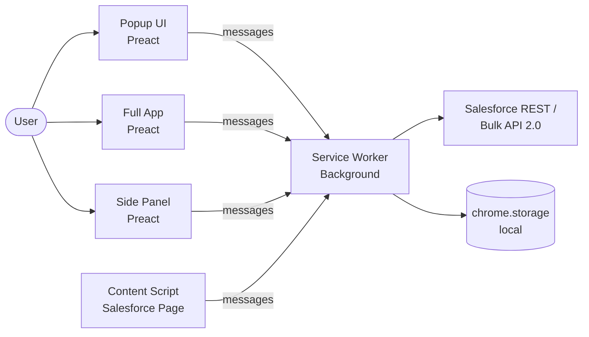

# WaveLink

**Your Salesforce data workbench — right in the browser.**

[](LICENSE)
[](package.json)
[](https://www.typescriptlang.org/)
[](https://developer.chrome.com/docs/extensions/mv3/intro/)
[](https://github.com/jc-wave/wave-link)

WaveLink is a free, open-source Chrome extension that gives Salesforce admins, developers, and consultants a complete toolkit for pushing, querying, comparing, cleaning, and managing data across orgs. It piggybacks on your existing Salesforce session — no OAuth apps, no connected apps, no setup. **Just install and go.**

> **Why open source?** Salesforce tooling shouldn't be locked behind paywalls. WaveLink was built because every team deserves powerful data tools without per-seat pricing or enterprise gates.

---

## Demo


> **Status:** Alpha (v0.1.0) — core features are stable and in active use. See [CHANGELOG](docs/CHANGELOG.md) for what shipped.
>
> [Chrome Web Store listing](#) · [Report a bug](https://github.com/jc-wave/wave-link/issues) · [Request a feature](https://github.com/jc-wave/wave-link/issues)


---

## Features

### Data Operations
- **Insert, Update, Upsert, Delete** — all four DML operations with a single interface
- **Smart API routing** — automatically uses REST Collections (≤ 2,000 records) or Bulk API 2.0 (> 2,000 records); no manual selection needed
- **Retry failed rows** — generates a new dataset from only the failed records so you can fix and re-push
- **Undo with one click** — `Ctrl+Z` rolls back the last insert using captured rollback data (up to 10 entries, 1-hour TTL)

### Query & Schema
- **SOQL builder with autocomplete** — context-aware parser detects the active clause and suggests objects, fields, and operators
- **Query library** — folders, favorites, tags, fuzzy search, drag-and-drop organisation; import/export as JSON bundles
- **Schema comparison** — field-level diff between any two objects with CSV/JSON/HTML export
- **Visual relationship explorer** — interactive object graph with depth control and pan/zoom

### Multi-Org Workflow
- **Org switcher** — click to switch between connected orgs; each keeps its own schema cache and session
- **Data comparison across orgs** — diff records field-by-field between sandbox and production; selectively sync differences
- **Environment badges** — PROD (red) and SBX (amber) labels so you never push to the wrong place

### Data Quality & Generation
- **Data cleanser + pipeline builder** — rename/drop/reorder columns, apply formula rules, chain filter/transform/lookup/aggregate steps visually
- **Duplicate detection** — exact, Levenshtein (fuzzy), or Soundex (phonetic) matching with a 3-step merge wizard
- **Test data generator** — faker.js-backed, auto-maps Salesforce field types, configurable null rates and static overrides
- **Data quality scorecards** — define required-field, regex, range, and uniqueness rules; score your dataset before pushing
- **Field usage analytics** — population rates, cardinality analysis, and actionable optimisation recommendations

### Import / Export
- **Import** — drag-and-drop CSV, JSON, or Excel files; no size limit warning up to ~10 MB
- **Export** — CSV, JSON, auto-sized Excel, and Salesforce-compatible XML; choose which columns to include

---

## Quick Start

### Prerequisites

| Requirement | Version |
|-------------|---------|
| Node.js | ≥ 18 |
| npm | ≥ 9 |
| Google Chrome | ≥ 115 (Manifest V3) |
| A Salesforce org | Any edition — must be logged in |

### 1. Clone and Build

```bash
git clone https://github.com/jc-wave/wave-link.git
cd wave-link
npm install
npm run build
```

The extension bundle is written to `dist/`.

### 2. Load into Chrome

1. Open **`chrome://extensions`** in Chrome
2. Enable **Developer mode** (toggle in the top-right corner)
3. Click **Load unpacked**
4. Select the **`dist/`** folder inside the cloned repo

WaveLink appears in your Chrome toolbar.

### 3. Connect a Salesforce Org

1. Open any Salesforce org in a browser tab (you must already be logged in)
2. Click the **WaveLink icon** in the toolbar
3. WaveLink auto-detects your org and connects — no credentials to enter

### 4. Verify

You should see your org name and environment (PROD / SBX) in the popup header. Click **Open Full App** to access all features.

> **No API keys. No OAuth setup. No configuration files.** WaveLink reads your existing `sid` session cookie — the same one Salesforce uses.

### Development Mode (watch + hot rebuild)

```bash
npm run dev      # Webpack in watch mode — reload the extension after each build
```

After webpack rebuilds, go to `chrome://extensions` and click the **reload icon** on the WaveLink card.

---

## Usage

### Basic: Push a CSV to Salesforce

1. Open the **WaveLink Full App** (`chrome://extensions` → WaveLink → Open Full App, or click "Full App" in the popup)
2. Navigate to **Data Push** (`Ctrl+Shift+P`)
3. Drag your CSV file onto the import area — WaveLink parses it and shows a field mapping table
4. Set the **SObject** (e.g. `Account`), choose **Insert**, map any unmapped columns
5. Click **Push** — progress updates in real-time; errors are grouped by message

### Basic: Run a SOQL Query

1. Navigate to **Query** (`Ctrl+Shift+Q`)
2. Use the structured builder: pick an object, add fields, set a WHERE clause and LIMIT
3. Click **Run** — results appear in a table with execution time and record count
4. Export results as CSV, JSON, Excel, or XML with the **Export** button

### Advanced: Compare Records Between Orgs

1. Ensure two orgs are connected (open each in a tab and click "Connect" in the popup)
2. Navigate to **Data Comparison**
3. Select **Source Org** and **Target Org** from the dropdowns
4. Choose the SObject and a matching field (Name, External ID, or any text field)
5. Run the comparison — added (green), removed (red), changed (blue), and unchanged records are shown
6. Check rows you want to sync and click **Push to Target**

### Advanced: Build a Data Cleansing Pipeline

1. Import your dataset (CSV/JSON/Excel)
2. Navigate to **Data Cleanser**
3. Use the **Pipeline Builder** tab to drag in steps:
   - **Filter** — remove rows that don't match a condition
   - **Transform** — apply formulas like `{FirstName} {LastName}` or conditional rules
   - **Lookup** — enrich records from a second dataset
   - **Aggregate** — group and roll up values
4. Preview the output at each step, then export or push directly

### UI Modes

| Mode | How to Open | Best For |
|------|-------------|----------|
| **Popup** | Click the WaveLink toolbar icon | Quick pushes, history, template access |
| **Side Panel** | `Ctrl+Shift+L` on any Salesforce page | Working alongside Salesforce without switching tabs |
| **Full App** | "Full App" button in popup or panel | Complex workflows — queries, comparisons, analytics |

---

## Configuration

WaveLink has no configuration files. All settings are stored in `chrome.storage.local` and managed through **Settings** (`Ctrl+K` → Settings).

### Settings Reference

| Setting | Required | Default | Description | Example |
|---------|----------|---------|-------------|---------|
| Theme | No | `auto` | Light, dark, or follow system preference | `dark` |
| Accent colour | No | Blue | UI accent colour token | `purple` |
| Panel width | No | `420px` | Default width of the in-page side panel | `500px` |
| Schema cache TTL | No | `30 min` | How long to cache SObject describe results | `60 min` |
| Keyboard shortcuts | No | See below | All shortcuts are rebindable in Settings | `Ctrl+Shift+D` |
| Push history limit | No | `100` | Max push history entries retained | `200` |
| Undo TTL | No | `1 hour` | How long undo data is retained | `2 hours` |

### Keyboard Shortcuts

| Shortcut | Action | Rebindable |
|----------|--------|-----------|
| `Ctrl+Shift+L` | Toggle WaveLink side panel | Yes (also registered in manifest) |
| `Ctrl+K` | Open command palette | Yes |
| `Ctrl+Shift+Q` | Navigate to Query | Yes |
| `Ctrl+Shift+P` | Navigate to Data Push | Yes |
| `Ctrl+Z` | Open undo panel | Yes |
| `Alt+↑` / `Alt+↓` | Reorder columns in Data Cleanser | Yes |

All shortcuts are configurable in **Settings → Keyboard Shortcuts** with conflict detection.

### Sample Storage State (internal representation)

```json
{
  "wl_orgs": [
    {
      "id": "00D...",
      "instanceUrl": "https://myorg.my.salesforce.com",
      "label": "Production",
      "environment": "production",
      "color": "red"
    }
  ],
  "wl_settings": {
    "theme": "auto",
    "accentColor": "blue",
    "panelWidth": "420px",
    "schemaCacheTtlMinutes": 30
  }
}
```

---

## Architecture

WaveLink follows the Chrome Extension Manifest V3 architecture with four isolated entry points communicating via a message bus.



| Layer | Entry Point | Responsibility |
|-------|-------------|---------------|
| **Background** | `src/background/index.ts` | Message routing, push orchestration, auth, schema cache, storage coordination |
| **Popup** | `src/popup/index.tsx` | Quick actions, org status, open full app |
| **Full App** | `src/app/index.tsx` | 19+ screens for all features |
| **Content Script** | `src/content/index.ts` | Org detection, in-page side panel injection |
| **Services** | `src/services/` | Salesforce API clients, Chrome message bus, storage wrapper |
| **Core** | `src/core/` | Types, constants, errors, shared utilities |
| **Data** | `src/data/` | Field mapping, schema-aware validation, templates |

See [docs/ARCHITECTURE.md](docs/ARCHITECTURE.md) for the full system design, data flow diagrams, and component inventory.

---

## Limits

| Constraint | Value | Notes |
|-----------|-------|-------|
| Max records per push | 25,000 | Bulk API 2.0 job cap in this build |
| Max file size | ~10 MB | Browser memory constraint |
| Bulk API threshold | 2,000 records | Auto-switches to Bulk API 2.0 above this |
| REST batch size | 200 records/request | SObject Collections (insert/update/delete) |
| Composite batch size | 25 subrequests | Composite API (upsert) |
| Bulk API poll timeout | ~10 minutes | 5-second poll interval |
| REST retry attempts | 3 | Exponential backoff on transient failures |
| Schema cache TTL | 30 minutes | Configurable in Settings |
| Undo history | 10 entries | 1-hour TTL per entry |
| Push history | 100 entries | Configurable in Settings |

> Salesforce API limits (daily API calls, governor limits) are enforced by the org, not WaveLink. Monitor usage on the **API Usage Dashboard** screen.

---

## Tech Stack

| Layer | Technology | Version |
|-------|-----------|---------|
| UI Framework | [Preact](https://preactjs.com/) | 10.x |
| Language | TypeScript | 5.5 |
| Bundler | Webpack | 5.x |
| Testing | Jest + JSDOM | 29.x |
| CSV Parsing | [Papa Parse](https://www.papaparse.com/) | 5.x |
| Excel | [SheetJS (xlsx)](https://shijs.com/) | 0.18.x |
| Test Data | faker.js (via test data generator util) | — |
| Extension Platform | Chrome Manifest V3 | — |
| Salesforce APIs | REST v59.0, Bulk API 2.0, Composite, Tooling | — |

---

## Security

WaveLink holds Salesforce session tokens in `chrome.storage.local` (device-only, never synced). It communicates only with Salesforce domains listed in `host_permissions`. No data is sent to any third-party server.

See [docs/SECURITY.md](docs/SECURITY.md) for the full threat model and safe configuration guidance.

---

## Contributing

WaveLink is MIT-licensed and welcomes contributions of all sizes — bug fixes, new features, docs improvements, or just ideas.

See [docs/CONTRIBUTING.md](docs/CONTRIBUTING.md) for the full dev setup guide, code conventions, and PR process.

Quick start for contributors:

```bash
git clone https://github.com/jc-wave/wave-link.git
cd wave-link
npm install
npm run dev          # watch mode
npm test             # run unit tests
npm run typecheck    # TypeScript check
npm run lint         # ESLint
```

---

## Roadmap

See [roadmap.md](roadmap.md) for the full feature roadmap. Highlights coming next:

- **Dependency-aware push** — topological ordering of inserts across related objects
- **Push dry run** — validate records against the target org without committing
- **Query results inline editing** — edit values in query results and save as an update push
- **Streaming large files** — raise the 10 MB / 25,000-record limits with chunked parsing
- **CLI / headless mode** — `npx wavelink push` for CI/CD pipelines

---

## License

MIT — use it, modify it, share it. See [LICENSE](LICENSE) for details.

Third-party libraries are used under their respective licenses (MIT, Apache 2.0). See [docs/SECURITY.md](docs/SECURITY.md#third-party-dependencies) for the dependency list.

---

Built with care for the Salesforce community. If WaveLink saves you time, give it a ⭐ and share it with your team.
