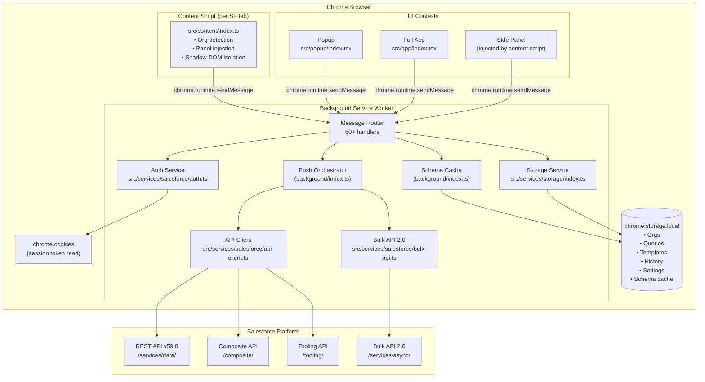
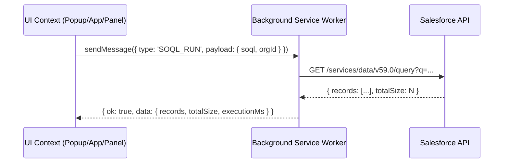
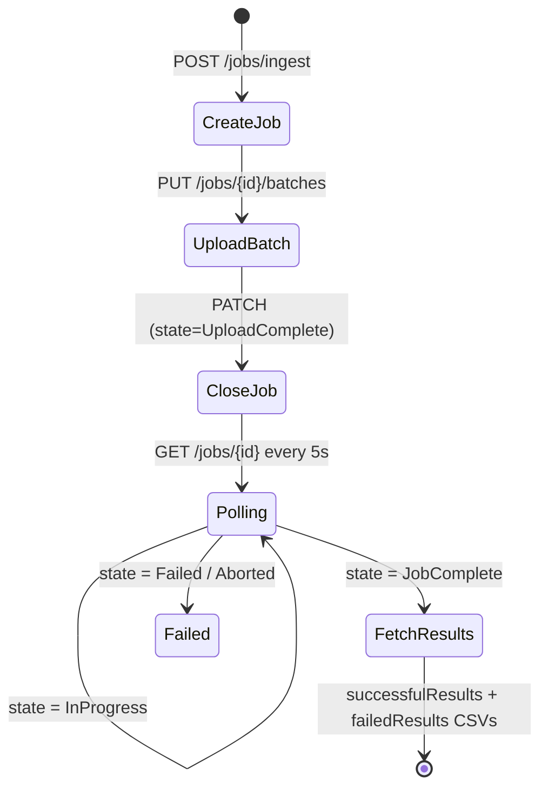
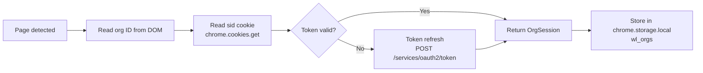
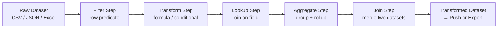
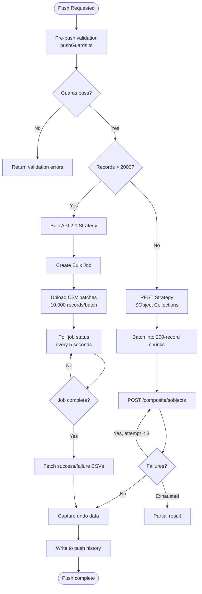
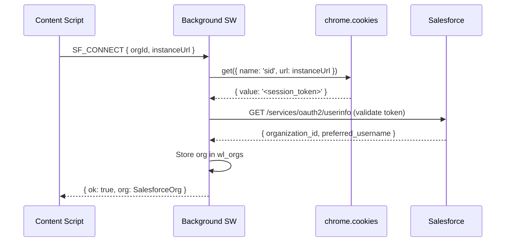

# WaveLink — Architecture

> Version 0.1.0 · Chrome Extension Manifest V3 · TypeScript + Preact

---

## Table of Contents

1. [Overview](#1-overview)
2. [Extension Entry Points](#2-extension-entry-points)
3. [Full System Diagram](#3-full-system-diagram)
4. [Background Service Worker](#4-background-service-worker)
5. [Message Bus](#5-message-bus)
6. [Salesforce Service Layer](#6-salesforce-service-layer)
7. [Storage Layer](#7-storage-layer)
8. [UI Layer](#8-ui-layer)
9. [Data Pipeline](#9-data-pipeline)
10. [Push Orchestration](#10-push-orchestration)
11. [Authentication Flow](#11-authentication-flow)
12. [Schema Cache](#12-schema-cache)
13. [Key Design Decisions](#13-key-design-decisions)
14. [Module Dependency Map](#14-module-dependency-map)

---

## 1. Overview

WaveLink is a **Chrome Manifest V3 extension** structured around four isolated JavaScript contexts that communicate over Chrome's extension message passing API:

| Context | File | Lifetime |
|---------|------|---------|
| Background Service Worker | `background/index.js` | Event-driven, ephemeral |
| Popup | `popup/popup.html` | While popup is open |
| Full App | `app/app.html` | While tab is open |
| Content Script | `content/index.js` | Per Salesforce tab |

All business logic lives in the **background** service worker. The three UI contexts (popup, app, content) are thin clients that send messages and render responses.

---

## 2. Extension Entry Points

```
dist/
├── background/index.js     ← Service worker (MV3)
├── popup/
│   ├── popup.html
│   └── index.js            ← Popup Preact app
├── app/
│   ├── app.html
│   └── index.js            ← Full-page Preact app
├── content/index.js        ← Content script (injected into *.salesforce.com)
└── icons/                  ← Extension icons (16/48/128px)
```

Webpack builds four entry points from `webpack.config.ts`. Each bundle is self-contained (`splitChunks: false`).

---

## 3. Full System Diagram



---

## 4. Background Service Worker

**File:** `src/background/index.ts` (~1,770 lines)

The background script is the application's brain. It:

- Registers 60+ `chrome.runtime.onMessage` handlers
- Manages Salesforce authentication lifecycle (token extraction, refresh, validation)
- Orchestrates all push operations (REST vs Bulk strategy selection, batching, retry, undo capture)
- Maintains the in-memory schema cache with TTL-based invalidation
- Coordinates org switching, multi-org state, and session isolation
- Handles undo transactions, push history, pipelines, quality rules, query storage

### Message Handler Categories

| Category | Example Messages | Notes |
|----------|-----------------|-------|
| Auth | `SF_CONNECT`, `SF_REFRESH_TOKEN` | Cookie read + token validation |
| Org management | `ORG_SWITCH`, `ORG_LIST`, `ORG_REFRESH` | Multi-org state |
| Push | `PUSH_START`, `PUSH_CANCEL`, `RETRY_FAILED` | Full orchestration |
| Query | `SOQL_RUN`, `QUERY_SAVE`, `QUERY_FOLDER_*` | SOQL + storage |
| Schema | `SCHEMA_DESCRIBE`, `SCHEMA_GLOBAL`, `SCHEMA_CACHE_CLEAR` | Cache-through |
| Storage | `TEMPLATE_*`, `HISTORY_*`, `PIPELINE_*`, `QUALITY_RULE_*` | CRUD wrappers |
| Undo | `UNDO_LIST`, `UNDO_EXECUTE` | Transaction rollback |
| Settings | `SETTINGS_GET`, `SETTINGS_SET` | Preferences |
| Onboarding | `ONBOARDING_GET`, `ONBOARDING_STEP` | First-run state |

---

## 5. Message Bus

**File:** `src/services/messaging/index.ts`

All cross-context communication uses typed message objects:

```typescript
// src/core/types/messaging.ts
interface WLMessage<T = unknown> {
  type: MessageType;   // string enum
  payload?: T;
}

interface WLResponse<T = unknown> {
  ok: boolean;
  data?: T;
  error?: string;
}
```

UI contexts call `sendMessage(type, payload)` which wraps `chrome.runtime.sendMessage` and returns a typed promise. The background handler responds with `WLResponse`.



---

## 6. Salesforce Service Layer

### API Client — `src/services/salesforce/api-client.ts`

| Method | API Endpoint | Notes |
|--------|-------------|-------|
| `query(soql)` | `GET /query` | Auto-paginates via `nextRecordsUrl` |
| `describeSObject(name)` | `GET /sobjects/{name}/describe` | Cached in background |
| `describeGlobal()` | `GET /sobjects` | Full object list |
| `getLimits()` | `GET /limits` | Governor limit stats |
| `collectionCreate(records)` | `POST /composite/sobjects` | 200 records/batch |
| `collectionUpdate(records)` | `PATCH /composite/sobjects` | 200 records/batch |
| `collectionDelete(ids)` | `DELETE /composite/sobjects?ids=...` | 200 IDs/batch |
| `composite(requests)` | `POST /composite` | 25 subrequests/batch |
| `toolingQuery(soql)` | `GET /tooling/query` | Metadata access |

### Bulk API Client — `src/services/salesforce/bulk-api.ts`

Implements the Bulk API 2.0 job lifecycle:



### Auth Service — `src/services/salesforce/auth.ts`



No OAuth connected app is required. WaveLink reads the `sid` session cookie that Salesforce sets when you log in via the browser.

---

## 7. Storage Layer

**File:** `src/services/storage/index.ts` (~600 lines)

All persistence uses `chrome.storage.local` (device-local, never synced across Chrome profiles by default).

### Storage Keys

| Key | Type | Contents |
|-----|------|---------|
| `wl_orgs` | `SalesforceOrg[]` | Connected org metadata and tokens |
| `wl_active_org` | `string` | Active org ID |
| `wl_queries` | `SavedQuery[]` | SOQL query library with folders |
| `wl_templates` | `DataTemplate[]` | Field mapping templates |
| `wl_history` | `PushHistoryEntry[]` | Push history (max 100) |
| `wl_pipelines` | `Pipeline[]` | Transformation pipeline definitions |
| `wl_quality_rules` | `QualityRuleSet[]` | Data quality rule sets |
| `wl_undo_txns` | `UndoTransaction[]` | Undo rollback data (max 10, 1h TTL) |
| `wl_schema_cache` | `SchemaCache` | SObject describe cache with TTL |
| `wl_settings` | `UserSettings` | Theme, accent, panel width, shortcuts |
| `wl_onboarding` | `OnboardingState` | First-run step tracking |

### Storage Limits

Chrome's `storage.local` has a default quota of **5 MB** (or unlimited with the `unlimitedStorage` permission, which WaveLink does not request). Large schema caches or push history can approach this limit; WaveLink auto-purges undo transactions past TTL and caps history at the configured limit.

---

## 8. UI Layer

**Framework:** Preact 10 (3 KB gzip; functionally identical to React hooks API)

**Styling:** CSS-in-JS via `src/ui/styles/uiCss.ts` — a single large CSS string injected into the document with design tokens. Dark mode is implemented with a `data-theme="dark"` attribute on the root element.

### Screen Inventory (21 screens)

| Screen | Route / Nav | Description |
|--------|-------------|-------------|
| `QueryScreen` | Query | SOQL builder, results table, history |
| `DataPushScreen` | Push | File import, field mapping, push execution |
| `DataCleanserScreen` | Cleanser | Column ops, formula rules |
| `PipelineBuilderScreen` | Pipeline | Visual step-chain builder |
| `DataComparisonScreen` | Compare Data | Cross-org record diff |
| `SchemaComparisonScreen` | Compare Schema | Field-level schema diff |
| `ObjectsScreen` | Objects | Browse SObject schemas and field metadata |
| `FieldAnalyticsScreen` | Analytics | Population/cardinality metrics |
| `RelationshipExplorerScreen` | Relationships | Interactive object graph |
| `ApiUsageDashboardScreen` | API Usage | Governor limits display |
| `OrgHealthScreen` | Org Health | Org health metrics overview |
| `CoverageScreen` | Coverage | Object/field coverage analysis |
| `TestDataGeneratorScreen` | Generate | faker.js data generation |
| `TemplatesScreen` | Templates | Template library CRUD |
| `DuplicateDetectionScreen` | Duplicates | Find & merge duplicates |
| `CloneWizardScreen` | Clone | Cross-object cloning with dependency graph |
| `BulkObjectOpsScreen` | Bulk Ops | Record count, bulk delete |
| `DataQualityScorecardScreen` | Quality | Rule-based scoring |
| `PushHistoryScreen` | History | Filterable push log |
| `SettingsScreen` | Settings | All user preferences |
| `HelpScreen` | Help | In-app help and documentation |

### Component Hierarchy

```
AppRoot
├── AppShell (navigation, org switcher, command palette)
│   ├── OrgSwitcher
│   ├── CommandPalette
│   └── [active Screen]
│       ├── Screen-specific components
│       └── Shared components (DataDiffView, SchemaDiffView, QueryFolderTree…)
```

---

## 9. Data Pipeline

The transformation pipeline (`src/ui/utils/pipelineExecutor.ts`) executes steps in sequence over an in-memory dataset:



Each step is a pure function `(rows: Row[]) => Row[]`, making steps composable and independently testable.

---

## 10. Push Orchestration



---

## 11. Authentication Flow



Token refresh is triggered 5 minutes before expiry using the refresh token stored alongside the session, if available.

---

## 12. Schema Cache

SObject `describe` results are expensive to fetch (one API call per object). WaveLink caches them in `chrome.storage.local`:

```
wl_schema_cache = {
  "<orgId>_<objectName>": {
    data: SObjectDescribe,
    fetchedAt: timestamp,
    ttlMs: 1800000  // 30 minutes default
  }
}
```

Cache reads check `fetchedAt + ttlMs > Date.now()`. Stale entries are refetched transparently. Users can manually clear the cache from Settings or the command palette.

---

## 13. Key Design Decisions

### Why Preact instead of React?

Chrome extensions have tight bundle size constraints. Preact is 3 KB gzipped vs React's ~40 KB. The hooks API is compatible, so migration to React is straightforward if needed.

### Why CSS-in-JS (single string injection)?

Content Security Policy in MV3 forbids `eval()` and inline scripts. CSS is injected as a `<style>` tag into the document or shadow DOM using `injectCss.ts`. This also allows WaveLink to apply its styles inside the shadow DOM of the in-page panel without polluting the host page.

### Why no OAuth connected app?

Requiring admins to create a Connected App adds friction and requires Salesforce admin access. WaveLink instead reads the `sid` cookie that the browser already holds after a normal login, keeping setup to zero steps. This is the same approach used by several established Salesforce browser tools.

### Why a single background service worker over a background page?

MV3 requires service workers instead of persistent background pages. The service worker is event-driven and can be terminated by Chrome between events. Push operations account for this: Bulk API polling is designed to restart gracefully if the service worker is relaunched mid-poll.

### Why `splitChunks: false` in webpack?

Each extension entry point must be a single self-contained file (Chrome's extension loader does not support dynamic module loading the way a web page does). Code sharing between bundles is achieved through the TypeScript path aliases and build-time tree-shaking rather than runtime chunk loading.

---

## 14. Module Dependency Map

```
src/
├── background/          depends on: services/*, core/*
├── popup/               depends on: ui/popup/*, ui/styles/, services/messaging/
├── app/                 depends on: ui/app/*, ui/styles/, services/messaging/
├── content/             depends on: ui/panel/*, ui/styles/, services/messaging/, core/*
├── core/
│   ├── types/           no dependencies (leaf)
│   ├── constants/       no dependencies (leaf)
│   ├── errors/          depends on: core/types/
│   └── utils/           depends on: core/types/, core/constants/
├── services/
│   ├── salesforce/      depends on: core/*
│   ├── messaging/       depends on: core/types/
│   └── storage/         depends on: core/*
├── data/
│   ├── mappers/         depends on: core/*, services/salesforce/
│   ├── validators/      depends on: core/*
│   └── templates/       depends on: core/*
└── ui/
    ├── api/             depends on: services/messaging/, core/types/
    ├── hooks/           depends on: ui/api/
    ├── utils/           depends on: core/*, data/*
    ├── components/      depends on: ui/utils/, ui/hooks/, core/types/
    ├── screens/         depends on: ui/components/, ui/utils/, ui/api/
    ├── app/             depends on: ui/screens/, ui/components/
    ├── popup/           depends on: ui/screens/, ui/components/
    ├── panel/           depends on: ui/screens/, ui/components/
    └── styles/          no dependencies (leaf)
```

Dependency flow is strictly **downward** — UI depends on services, services depend on core. There are no circular dependencies between layers.
